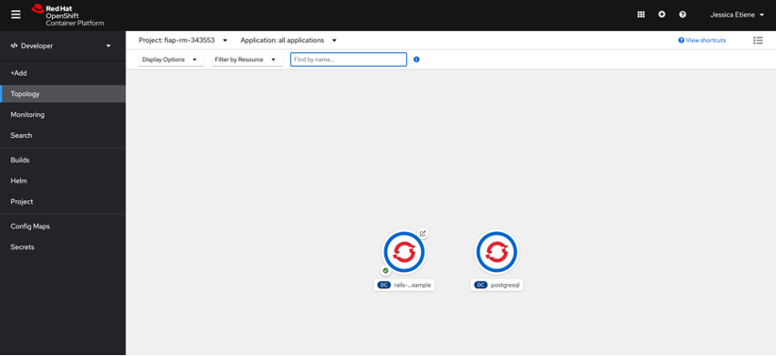
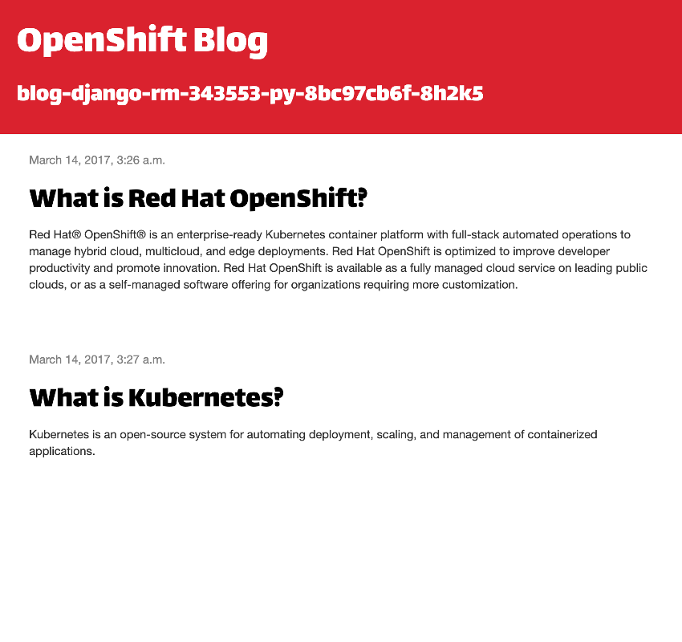
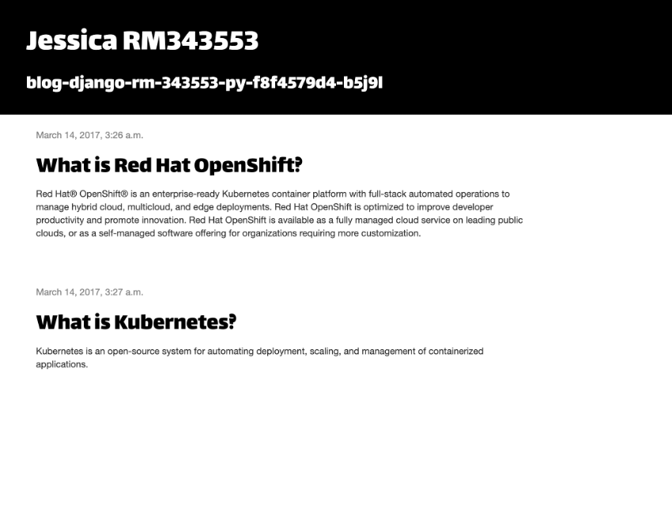

# fiap-containerization-strategy

Conteúdo da fase 4 do curso de Arquitetura de soluções FIAP - ASO08


## Aula 1 - Criação do laboratório e customização da imagem



# Blogpost




# Blog Customizado

```
BLOG_SITE_NAME=Jessica RM343553
BLOG_BANNER_COLOR=black
```


