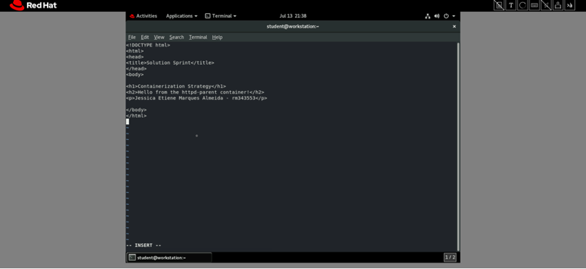
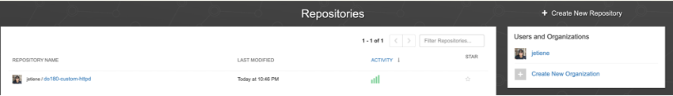
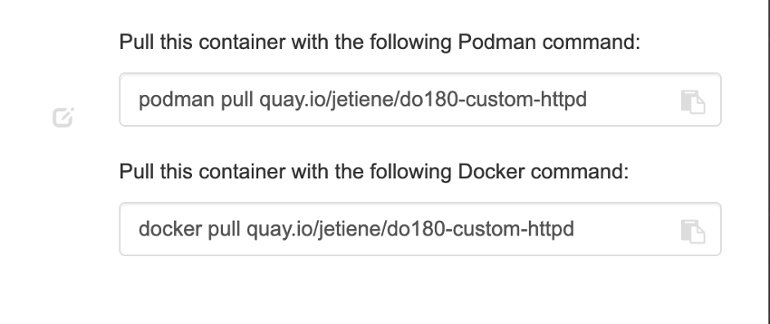
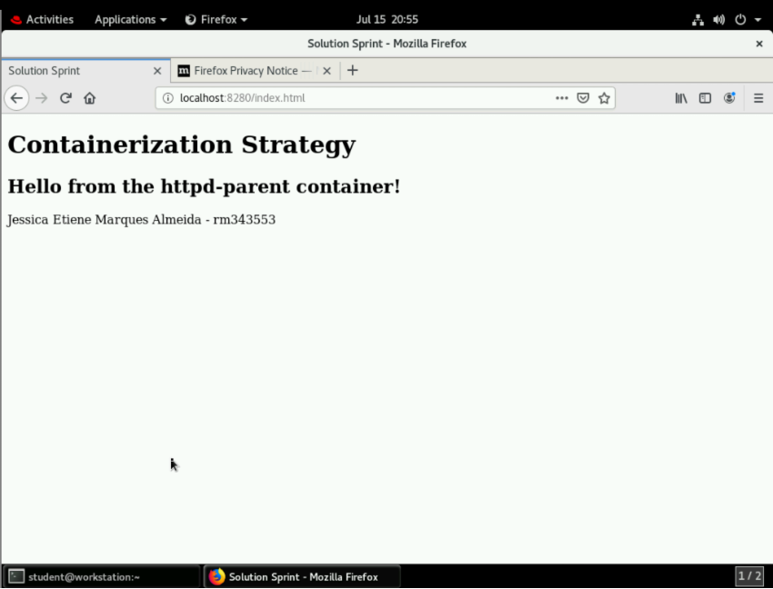

# Passos para customização de imagem no openshift

```$ lab image-operations start```

```$ podman login quay.io```

```$ podman run -d --name official-httpd -p 8180:80 quay.io/redhattraining/httpd-parent```

```$ exec -it official-httpd /bin/bash```


```$ cd var/www/html/```

```$ touch index.html```


```$ vi index.html```

# Conteúdo do index html

## Customizando imagem



```
<!DOCTYPE html>
<html>
    <head>
        <title>Solution Sprint</title>
    </head>
    <body>

        <h1>Containerization Strategy</h1>
        <h2>Hello from the httpd-parent container!</h2>
        <p>Jessica Etiene Marques Almeida - rm343553</p>

    </body>
</html>

```

```$ podman stop official-httpd```

```$ podman commit -a 'Jessica Etiene' official-httpd do180-custom-httpd```

```$ podman images```

```$ podman tag do180-custom-httpd quay.io/jetiene/do180-custom-httpd:v1.0```

```$ podman push quay.io/jetiene/do180-custom-httpd:v1.0```

# Push da imagem para o repositoriio quay.io




# Pull da imagem

```$ podman pull -q quay.io/jetiene/do180-custom-httpd:v1.0```

```$ podman run -d --name test-httpd -p 8280:80 jetiene/do180-custom-httpd:v1.0```


# Acessando http://localhost:8280/index.html


